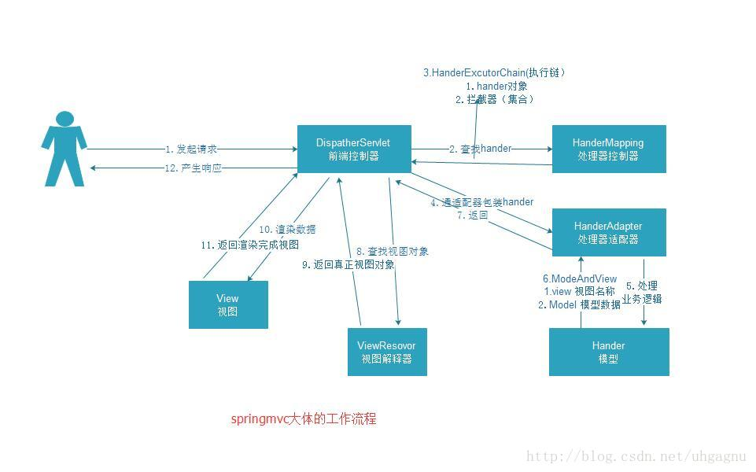
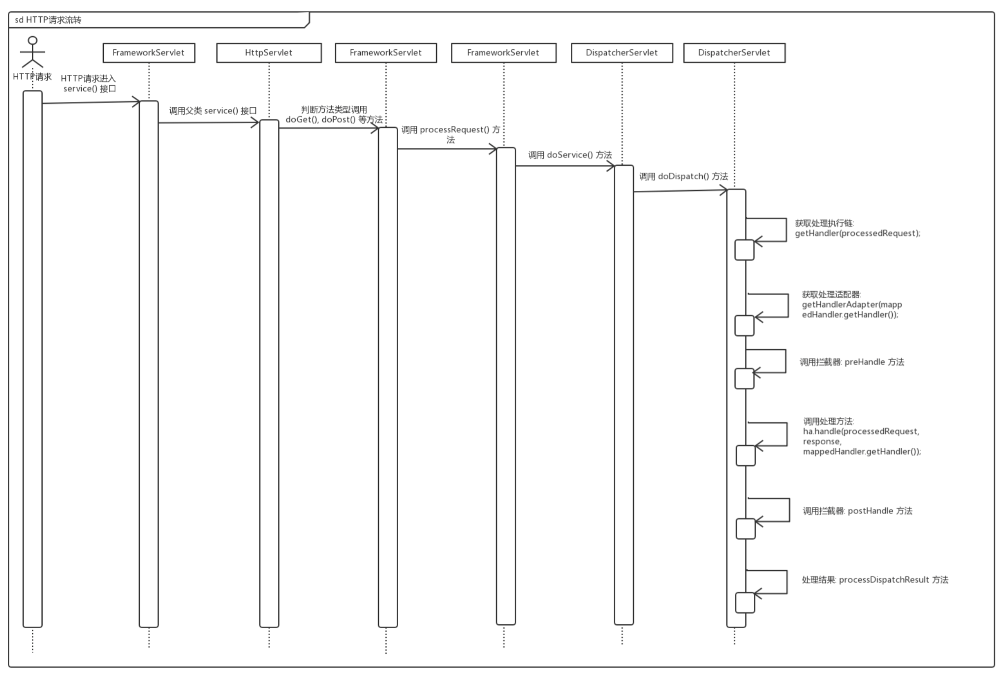

### java项目相关知识点
----
#### spring,springMVC相关
----
springMVC入门及源码分析:http://blog.csdn.net/column/details/13023.html

* 项目中遇到的比较有挑战的问题(感觉也是会问的)
	怎么解决
	
* tomcat访问404可能的问题
    * tomcat/webapps中明明有项目文件夹,但是通过浏览器就是访问不到文件夹中的网页,有可能是因为配置文件中的mysql连接失败,不知道为什么会导致无法访问所有文件.
    * web.xml中配置有问题的话有可能会导致tomcat启动不起来

* 项目中使用的设计模式,感觉比较重要
	1. 单例模式
	安卓开发中使用过,MyApplication类,使用的单例模式,用来进行全局设置,如服务器地址,屏幕宽度高度等,一些初始化信息.
	2. 代理模式
		* 简单静态代理模式
			1. 适合使用在需要代理的类不多且确定的场景
			比如日志,就是写一个代理类,实现代理对象的实现的接口,接受代理对象作为成员变量,然后在调用代理对象方法前后增加日志,这种代理能解耦,但是无法减少代码量
		* JDK动态代理(参考地址:https://blog.csdn.net/bjyfb/article/details/7350256)
			1. 比静态代理灵活,但是前提是代理目标有实现接口
			写一个LogHandler类实现InvocationHandler接口,实现其中的`invoke(Object proxy, Method method, Object[] args)`方法,在这个方法中实现代理,添加一个`newProxyInstance(Object targetObject)`来返回一个生成的代理对象`return Proxy.newProxyInstance(classLoader,interface,this)`,
				* 如何转发到invoke()方法?
				
		* CGlib动态代理(适用于代理对象没有实现接口的场景)


	3. 回调函数
	参考地址:https://zhuanlan.zhihu.com/p/30052334
	https://blog.csdn.net/cangchen/article/details/44063359
		1. 回调函数是什么:
			* 回调机制就是,按照约定的接口,把内部工作流的某个功能暴露给外部使用者,让外部使用者提供数据或者实现
			* 回调函数是一个功能片段,什么时候调用由工作流决定(比如按钮),回调函数的实现者不能直接调用回调函数实现工作流的功能
		2. 应用场景:
			1. 安卓中的按键监听器,`button.setOnClickListener(new OnClickListener{...})`
			2. 多线程的Runnable接口,自定义run方法实现接口,然后传入Thread,什么时候调用run()方法由工作流决定
			3. 等待网络任务的同时不能阻塞主线程任务的时候
			4. 当工作流中某个功能需要调用者来定义的时候
		3. 优点:
			1. 工作流中的某个功能可以在调用的时候来实现,灵活,比如安卓中的Button和imageButton会进行不同的业务
			2. 


* 开源框架
	* Spring
		* 依赖注入
		* 控制反转
		* 代理
		* 事务管理
		* Bean的实例化过程

	* MyBatis
		* 数据关联
		* 动态映射
		* 事务关联

* 常用shell命令
	* top,ps,curl,scp,ssh
	* 看懂复杂的shell脚本
	* 网络相关Http,tcp,netty等 

* 数据库事务,可重复读
数据库事务:银行转账的例子
数据库的隔离级别:
	1. read UNcommited(未提交读) 允许读取未提交的数据:最低级别,可以使用排他血写锁实现,可以读取到已经修改但是未提交的数据
	可能出现各种读
	2. read committed(提交读) 允许不可重复读:可以使用共享读锁(读取完该行就释放)和排它写锁来实现,对于同一数据项,前面读取的数据和后来读取的数据可能不一样
	可能出现不可重复读和幻读
	3. repeated read(可重复读) 可重复读如何实现:可以通过共享读锁(直到事务结束才释放)和排它写锁来实现.数据库进行读事务的时候就会禁止其他的写事务,进行写事务的时候就会禁止其他任何事务写操作
	可能出现幻读,因为其他事务虽然不能修改该行数据,但是可以新增数据行,
	4. serializable(可序列化) 可序列化:最高级别,事务串行
由于低级别隔离性产生的问题:
	1. 脏读:事务1删除了表中唯一数据a,但是没有提交,此时事务2查询表返回为空,这就是脏读,然后准备插入数据a,这时候事务1发生回滚,表中又有了数据a,事务2插入错误
	2. 幻读:重点在插入了新数据,事务1查询返回结果为空表,此时事务2插入新数据a并提交,然后事务1也插入数据a,此时报错,刚刚明明是空表,现在却提示数据冲突.
	3. 不可重复读:重点在于修改了数据,事务1读取到数据a,此时事务2将数据a修改成数据b,然后事务1再次读取数据a时就变成了数据b
产生死锁的可能:
	1. 事务1获取数据a的锁,想要访问数据b,但是此时数据b被事务2锁定,而事务2希望访问数据a,陷入相互等待的局面.
	解决的方式就是从根源上避免这种情况的出现,就是修改程序逻辑,避免出现环,可以一开始就将所有要用到的资源锁定
	还有就是采用抢占和回滚机制,根据时间戳来判断事务应该回滚还是等待
并发控制机制
	1. 悲观锁
	就是之前的共享锁和互斥锁(排它锁)
	2. 乐观锁(其实是一种并发控制思想,基于时间戳)
	3. 多版本并发控制(MVCC)
	就是为数据的每一个写操作创建版本,在进行读操作的时候就会在有限多的版本中选择最合适的返回

* tomcat Servlet是不是线程安全的:
	单例模式,当客户端第一次请求该servlet的时候会根据web.xml实例化servlet,之后客户端再访问该servlet使用的就是同一实例,是不是线程安全看servlet的实现,如果servlet的内部属性会被多线程改变,那就是不安全的.

* spring加载bean的过程

* spring和springMVC的区别和联系
	1. spring是父容器,springMVC是子容器,spring容器中有Service层的bean,springMVC容器中有Controller层的bean,子容器中找不到的bean可以去父容器中找,但是父容器不能在子容器中查找bean,这就是为什么由SpringMVC容器创建的Controller可以自动注入Spring容器创建的Service的bean了

* 传统springMVC模式和前后端分离
	1. 传统MVC模式的不足
		1. 每次请求都必须经过"控制器-模型-视图"才能最终在浏览器上呈现,过程略显复杂
		2. 视图依赖于模型,没有模型,浏览器就无法展示页面,客户体验不好
		3. 视图的渲染是在服务器端进行的,最后返回给浏览器的是带有模型的视图,渲染性能不能得到很好的优化
	2. 前后端分离的方式
	就是浏览器发送AJAX请求,然后收到JSON数据返回,然后浏览器来渲染页面

* `@ResponseBody`注解使用的返回值处理器是`RequestResponseBodyMethodProcessor`，调用 `HttpMessagConverter` 消息转换机制。

* 返回json数据中文乱码的问题
	1. 方法1:在springMVC.xml中配置
```
<!-- 处理请求返回json字符串的中文乱码问题 -->  
    <mvc:annotation-driven>  
        <mvc:message-converters>  
            <bean class="org.springframework.http.converter.StringHttpMessageConverter">  
                <property name="supportedMediaTypes">  
                    <list>  
                        <value>application/json;charset=UTF-8</value>  
                    </list>  
                </property>  
            </bean>  
        </mvc:message-converters>  
    </mvc:annotation-driven>  
```
	2. 方法二:在url映射注解中添加一段
	`@RequestMapping(value="/getUsersByPage",produces = "application/json; charset=utf-8")`
* SpringMVC HTTP请求响应的过程

springMVC基本工作流程图

SpringMVC中HTTP请求处理流程时序图
>1.用户发起请求到前端控制器。
2.前端控制器通过处理器映射器查找handler。
3.处理器映射器返回执行链。
	a)handler对象
	b)拦截器（集合）
4.前端控制器通处理器适配器包装，执行handler对象。思考：为什么要通过适配器来执行？
5.通过模型handler处理业务逻辑。
6.处理业务完成后，返回ModeAndView对象，其中有视图名称，模型数据。
7.将视图名称和模型数据返回到前端控制器。
8.前端控制器通过视图解释器查找视图对象。
9.视图解释器返回真正的视图。
10.前端控制器通过返回的视图和数据进行渲染。
11.返回渲染完成的视图。
12.将最终的视图返回给用户，产生响应。

* 可重入锁和synchronized的区别
	1. 锁的实现:
	ReentrantLock是JDK实现的,synchronized是依赖于JVM实现的
	2. 性能的区别:
	JDK1.6之后(synchronized引入了偏向锁,轻量级锁(自旋锁)之后)synchronized优化的与ReentrantLock性能差不多,在两种方法都可以使用的情况下官方建议使用synchronized,都是试图在用户态就将加锁问题解决,避免进入内核态
	3. 功能的区别:
	synchronized的使用比较简洁,由编译器保证加锁和施放锁,而ReentrantLock需要手工声明加锁和施放锁,但是ReentrantLock在锁的细粒度和灵活性方面更强
		1. ReentrantLock可以指定公平锁和非公平锁,synchronized只能是非安全锁
		2. ReentrantLock提供了一个Condition类来实现按照满足条件分组唤醒线程,而synchronized只能是随机唤醒一个线程,要么全部唤醒
		3. ReentrantLock提供了一个可以中断等待锁的机制,通过lock.lockInterruptibly()来实现这个机制


* spring框架的基本原理
>基本原理其实就是通过反射(反射的原理)解析类及其类的各种信息，包括构造器、方法及其参数，属性。然后将其封装成bean定义信息类、constructor信息类、method信息类、property信息类，最终放在一个map里，也就是所谓的container，池等等，其实就是个map。。汗。。。。当你写好配置文件，启动项目后，框架会先按照你的配置文件找到那个要scan的包(一般是哪些包?)，然后解析包里面的所有类，找到所有含有@bean，@service等注解的类，利用反射解析它们，包括解析构造器，方法，属性等等，然后封装成各种信息类放到一个map里。每当你需要一个bean的时候，框架就会从container找是不是有这个类的定义啊？如果找到则通过构造器new出来（这就是控制反转，不用你new,框架帮你new），再在这个类找是不是有要注入的属性或者方法，比如标有@autowired的属性，如果有则还是到container找对应的解析类，new出对象，并通过之前解析出来的信息类找到setter方法，然后用该方法注入对象（这就是依赖注入）。如果其中有一个类container里没找到，则抛出异常，比如常见的spring无法找到该类定义，无法wire的异常。还有就是嵌套bean则用了一下递归，container会放到servletcontext里面，每次reQuest从servletcontext找这个container即可，不用多次解析类定义。如果bean的scope是singleton，则会重用这个bean不再重新创建，将这个bean放到一个map里，每次用都先从这个map里面找。如果scope是session，则该bean会放到session里面。仅此而已，没必要花更多精力。

* 数据库索引
	1. B+树的介绍
	参考地址:http://blog.csdn.net/guoziqing506/article/details/64122287
	与b树相比较
		1. b+树的磁盘读写代价更低,因为b+树的内部节点并没有指向关键字的指针的具体信息
		2. 查询效率更加稳定,因为内部节点并不是指向最终文件内容的节点,而是指向关键字的节点,所以每一次查询都必须从根节点到叶子结点,长度相同
		3. b树在解决io效率的时候并没有解决元素遍历效率低下的问题,而b+树只需要遍历叶子节点就能解决对所有关键字的查询,对于数据库中经常使用的范围查询性能更高
	2. 创建索引的原则:
		1. 最左前缀匹配原则
		2. =和in可以乱序,mysql会自动优化
		3. 尽量选择区分度高的列来做索引
		4. 索引列不能参与计算
		5. 尽量扩展索引而不是新建
	3. 慢查询优化:
	参考地址:https://tech.meituan.com/mysql-index.html
		0. 先运行看看是否真的很慢，注意设置SQL_NO_CACHE
		1. where条件单表查，锁定最小返回记录表。这句话的意思是把查询语句的where都应用到表中返回的记录数最小的表开始查起，单表每个字段分别查询，看哪个字段的区分度最高
		2. explain查看执行计划，是否与1预期一致（从锁定记录较少的表开始查询）比如`explain select * from test1 where id=1;`
		3. order by limit 形式的sql语句让排序的表优先查
		4. 了解业务方使用场景
		5. 加索引时参照建索引的几大原则
		6. 观察结果，不符合预期继续从0分析


* CSRF:Cross—Site Request Forgery(跨站请求伪造)
参考地址:http://blog.csdn.net/stpeace/article/details/53512283
过程:
1. me登录网易邮箱
2. hack制作了钓鱼网站
3. me在没有登出邮箱的时候访问了钓鱼网站
4. 于是钓鱼网站通过me的浏览器访问了网易邮箱,带着me的cookie(此时me的浏览器与网易邮箱网站服务器之间的session尚未过期)进行了一些操作

* 防御CSRF攻击
1. 验证HTTP referer字段
HTTP referer指向前一个网页的URL,而hack要发起跨站请求伪造的话只能通过他的钓鱼网站发起,合法的HTTP referer一般都是网易邮箱的页面的URL.但是这种方法依赖于浏览器的安全性和设置,浏览器可以设置成不带上referer值
2. 在请求地址中添加token并验证
服务器生成token发给客户端,然后客户端发起请求的时候带上token
GET将token放在URL后面
POST则将请求放在form标签最后加上`<input type="hidden" name="token" value="tokenValue">` 
但是一些论坛网站中token很难保证安全,以为用户可以自己发帖子,然后帖子中的链接就会带上token
3. 在HTTP头中增加自定义属性并验证

* cookie和session
	1. Cookie
	用cookie写一个历史浏览记录
	2. session
	*用session实现购物记录*
		1. session的原理 
		2. 设置session的有效期 
		3. 浏览器禁用Cookie后servlet共享数据导致的问题:url重写
	*session的常见应用*
		1. 登录 
		2. 防止表单重复提交 前台javaScript 后台表单带随机数 
		3. 实现一次性校验码
	实现带验证码的登录

* 用过的过滤器filter
	* CrossFilter
```
public void doFilter(ServletRequest servletRequest, ServletResponse servletResponse, FilterChain filterChain) throws IOException, ServletException {
        HttpServletResponse response= (HttpServletResponse) servletResponse;
        String origin= servletRequest.getRemoteHost()+":"+servletRequest.getRemotePort();
        response.setHeader("Access-Control-Allow-Origin", "*");
        response.setHeader("Access-Control-Allow-Headers", "Origin, X-Requested-With, Content-Type, Accept");
        response.setHeader("Access-Control-Allow-Methods","POST,GET,OPTIONS,DELETE");
       /* response.setHeader("Access-Control-Allow-Methods","POST,GET,OPTIONS,DELETE");
        response.setHeader("Access-Control-Max-Age","3600");
        response.setHeader("Access-Control-Allow-Credentials","true");*/
        filterChain.doFilter(servletRequest,servletResponse);
    }
```
	1. HtmlFilter(防止XSS攻击)
	参考地址:http://blog.csdn.net/qq924862077/article/details/62053577
```
import javax.servlet.*;
import javax.servlet.http.HttpServletResponse;
@WebFilter("/HtmlFilter")
public class HtmlFilter implements Filter {

	public void doFilter(ServletRequest req, ServletResponse resp, FilterChain chain) throws IOException, ServletException {
		HttpServletRequest request = (HttpServletRequest) req;
		HttpServletResponse response = (HttpServletResponse) resp;
		MyHtmlRequest htmlRequest = new MyHtmlRequest(request);
		chain.doFilter(htmlRequest, response);
	}

	class MyHtmlRequest extends HttpServletRequestWrapper{
		public MyHtmlRequest(HttpServletRequest request) {
			super(request);
		}
		@Override
		public String getParameter(String name) {
			
			String value = super.getParameter(name);
			if(value == null) return null;

			return filter(value);
		}
		
		public  String filter(String message) {
	        if (message == null)
	            return (null);
	        char content[] = new char[message.length()];
	        message.getChars(0, message.length(), content, 0);
	        StringBuilder result = new StringBuilder(content.length + 50);
	        for (int i = 0; i < content.length; i++) {
	            switch (content[i]) {
	            case '<':
	                result.append("&lt;");
	                break;
	            case '>':
	                result.append("&gt;");
	                break;
	            case '&':
	                result.append("&amp;");
	                break;
	            case '"':
	                result.append("&quot;");
	                break;
	            default:
	                result.append(content[i]);
	            }
	        }
	        return (result.toString());
	    }
	}
}
```
	2. CharactorFilter
```
import javax.servlet.*;
import javax.servlet.http.HttpServletResponse;

/**
 * Servlet Filter implementation class CharacterEncodingFilter
 */
@WebFilter("/CharacterEncodingFilter")
public class CharacterEncodingFilter implements Filter {
	private String charset ;
	private String defaultCharset = "UTF-8";

	public void doFilter(ServletRequest req, ServletResponse resp, FilterChain chain) throws IOException, ServletException {
		HttpServletRequest request = (HttpServletRequest) req;
		HttpServletResponse response = (HttpServletResponse) resp;
		request.setCharacterEncoding(charset);
		response.setCharacterEncoding(charset);
		response.setContentType("text/html;charset=" + charset);
		request.setAttribute("charset", charset);	
		chain.doFilter(new MyRequest(request), response);
	}

	public void init(FilterConfig fConfig) throws ServletException {
		String charset = fConfig.getInitParameter("charset");
		if(charset == null){
			charset = defaultCharset;
		}
		this.charset = charset;
	}

}

class MyRequest extends HttpServletRequestWrapper{
	private HttpServletRequest request;
	public MyRequest(HttpServletRequest request) {
		super(request);
		this.request = request;
	}
	@Override
	public String getParameter(String name) {
		String value = request.getParameter(name);
		if(value == null) return null;
		if(!request.getMethod().equals("get")){
			return value;
		}
		try {
			value = new String(value.getBytes("ios8859-1"),request.getParameter("charset"));
		} catch (UnsupportedEncodingException e) {
			throw new RuntimeException(e);
		}
		return value;
	}
}
```
* spring的特性
	1. IoC(控制反转)
	所谓	
	2. AOP(面向切面编程)
	参考网址:	https://www.liaoxuefeng.com/article/0013738774263173c42eae58864423698dd40556af23bb5000
	比较常见的就是日志记录,如果不使用aop的话,例子中**实现日志功能的代码就是切面,而需要添加日志的类或者方法就是切点.**
		1. 就会在业务组件的核心功能之外附带了其他功能代码,会让业务代码变得混乱,业务组件应该只关心核心功能的实现
		2. 比如日志功能如果在多个组件中被使用,那么日志功能的业务逻辑发生改变时,维护修改就很麻烦
	使用场景:
		1. 日志应用:可以在日志中输出监控对象的方法调用的参数输入,返回结果等
		比如要监控的对象是要监控`LoginServiceImpl.login(String name,String password)`,只需要准备一个`LogServiceImpl`,`LogServiceImpl`中实现无参日志方法,有参日志方法,还有有参有返回值的日志方法,然后通过`applicationContext.xml`中的`<aop:config>`将其中一个日志方法织入`LoginServiceImpl`中配置,然后在客户端调用login方法的时候日志中就会有相应的输出内容
	参考地址:http://www.cnblogs.com/yulinfeng/p/7719128.html
		1. 通知(Advice)
		定义切点何时工作,以工作内容
			1. 前置通知(Before):一般是方法调用前打出传入参数
			2. 后置通知(After):是返回和异常通知的并集
			3. 返回通知(After-running):方法正常返回
			4. 异常通知(After-throwing):方法抛出异常
			5. 环绕通知(Around):可以同时定义前置和后置
		2. 切点(PointCut)
		定义在何处工作,也就是对哪个方法应用通知

```
<bean id="logService" class="cn.com.spring.service.impl.LogServiceImpl"></bean> 
<bean id="loginService" class="cn.com.spring.service.impl.LoginServiceImpl"></bean> 
<aop:config> 
    <!-- 切入点 --> 
    <aop:pointcut 
        expression="execution(* cn.com.spring.service.impl.LoginServiceImpl.*(..))" 
        id="myPointcut" /> 
    <!-- 切面： 将哪个对象中的哪个方法，织入到哪个切入点 --> 
    <aop:aspect id="dd" ref="logService"> 
        <!-- 前置通知 
        <aop:before method="log" pointcut-ref="myPointcut" /> 
        <aop:after method="logArg" pointcut-ref="myPointcut"> 
		--> 
        <aop:after-returning method="logArgAndReturn" returning="returnObj" pointcut-ref="myPointcut"/> 
    </aop:aspect> 
</aop:config> 
```
		2. 权限控制,本质上就是一种代理:

	3. Kafka监听端口


#### 设计模式相关
参考地址:http://xvshell.iteye.com/blog/2363443
参考地址:http://www.jasongj.com/design_pattern/proxy_decorator/
* 代理模式
	* JDK动态代理:适用于要代理的业务类实现接口的情况
	* CGlib代理:适用于要代理的业务类没有实现接口的情况
代理模式可以对代理对象进行增强,不过主要还是对代理对象的访问进行拦截
创建代理的步骤:
	1. 首先定义一个代理类并实现要代理的接口
	2. 将要代理的接口声明为成员属性,一种是直接new一个要代理的对象(这种方式下使用代理的人甚至都不知道被代理对象的存在),另一种是将要代理的对象作为参数传入(这样就和装饰模式有点像)
	3. 定义代理类的构造函数,在构造函数张
	4. 实现接口的方法,并在方法中调用构造函数中传入的代理对象的方法,这个时候就可以对代理对象进行加强或者拦截


* 装饰模式
装饰模式就是给被装饰的对象附加更多的功能,而且可以自由组合
装饰模式的实现:
	1. 定义一个装饰类并实现要装饰的接口
	2. 将接口定义为成员变量
	3. 定义构造函数并将要装饰的接口作为参数传入
	4. 然后可以定义增强功能的类并实现要装饰的接口
	5. 使用的时候就是new一个要装饰的对象,然后new一个装饰类对象,将要装饰的对象作为构造参数,然后再new另外一个装饰类对象,将刚刚这个装饰类对象作为参数传入,以此类推

