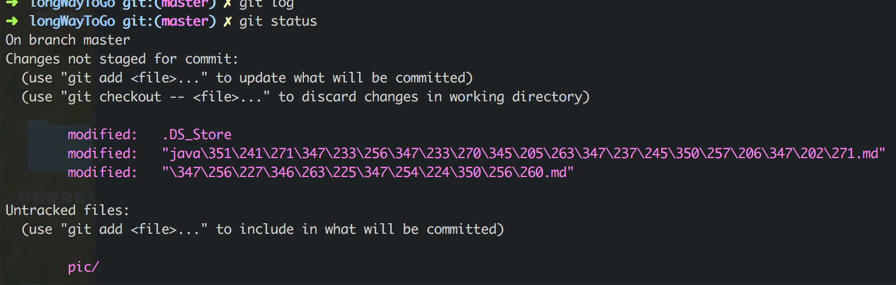

##### mac终端git中文显示的问题

* 可以在终端中执行以下命令解决
	`git config --global core.quotepath false`
* 或者oh-my-zsh的话
	1. 打开oh-my-zsh配置文件 ~/.zshrc 。
	2. 在文件最后面添加如下代码：
		```
		export LC_ALL=en_US.UTF-8
		export LANG=en_US.UTF-8
		```
	3. 重启下终端（terminal）或输入 source ~/.zshrc
